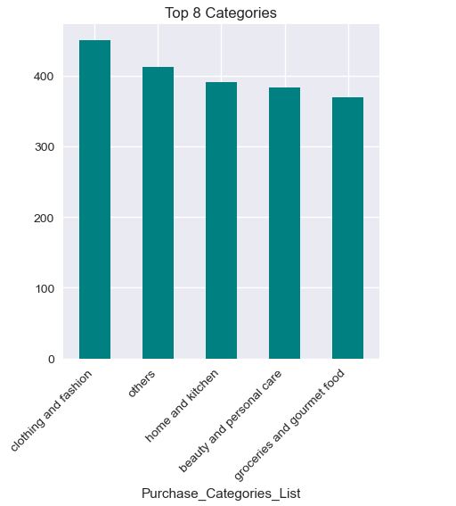
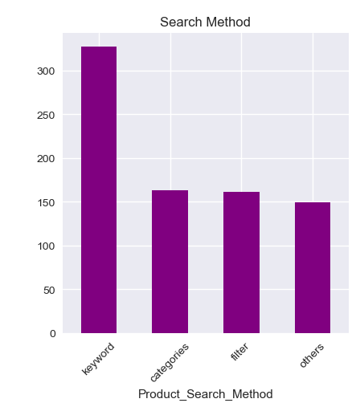
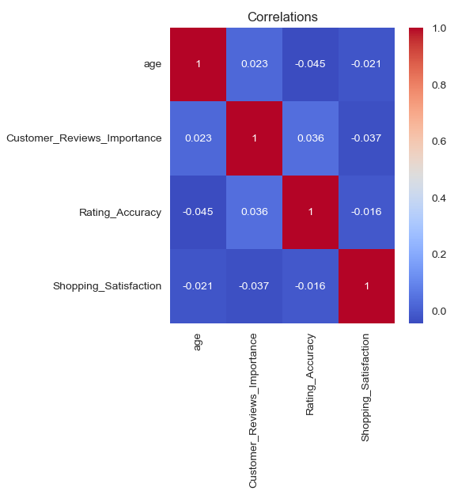

<p align="center">


</p>

<p align="center">


</p>

# 📊 Market Basket Analysis with Python

A data analytics project that applies **Market Basket Analysis** to identify product purchasing patterns using the **Apriori Algorithm** and **Association Rule Mining**.

---

## 📌 Project Overview

Retail businesses generate thousands of transactions every day. Understanding which products are frequently purchased together helps businesses optimise product placement, cross-selling, and recommendation systems.

This project analyses transactional data using Python to discover meaningful product associations.

---

## 🎯 Business Problem

Retailers need to answer questions like:

- Which products are frequently bought together?
- What combinations increase sales?
- How can recommendations improve customer experience?
- Which products should be placed together?

Market Basket Analysis helps answer these questions using association rules.

---

## 📂 Dataset

The dataset contains transactional purchase records including:

- Invoice ID
- Product Name
- Quantity
- Transaction ID

---

## 🛠️ Technologies Used

- Python
- Pandas
- NumPy
- mlxtend
- Matplotlib
- Jupyter Notebook

---

## 📈 Workflow

1. Import dataset
2. Data Cleaning
3. Data Transformation
4. One-Hot Encoding
5. Apriori Algorithm
6. Association Rule Mining
7. Result Analysis
8. Business Recommendations

---

## 📊 Results

The analysis identifies:

- Frequently purchased product combinations
- Strong association rules
- Confidence and Lift values
- Customer purchasing behaviour

These insights can support:

- Product recommendations
- Store layout optimization
- Cross-selling strategies
- Marketing campaigns

---

## 📊 Key Insights

- Identified frequently purchased product combinations using the Apriori algorithm.
- Measured association strength through **Support**, **Confidence**, and **Lift** metrics.
- Revealed cross-selling opportunities that can increase average order value.
- Highlighted purchasing patterns useful for inventory planning.

---

## 💼 Business Value

This analysis enables retailers to:

- Improve product recommendations.
- Increase cross-selling opportunities.
- Optimise product placement within stores.
- Reduce inventory planning errors.
- Enhance customer shopping experience.

---

## 📈 Business Recommendations

- Bundle products that are frequently purchased together.
- Place associated products near each other.
- Launch targeted promotions based on purchase patterns.
- Continuously monitor transaction data for changing trends.

---

## 📷 Sample Outputs

### Data Preview

<p align="center">
  
</p>

### Frequent Itemsets

<p align="center">
  
</p>

### Association Rules

<p align="center">
  
</p>

---

## 📁 Repository Structure

```
Market-Basket-Analysis-with-Python
│
├── README.md
├── project.ipynb
├── summary.docx
└── images
```

---

## 🚀 Future Improvements

- Interactive Power BI Dashboard
- Larger retail datasets
- Recommendation System
- Real-time analytics
- Customer segmentation

---

## 👨‍💻 Author

**Anadi Singh**

- GitHub: https://github.com/anadi-singh
- LinkedIn: https://www.linkedin.com/in/anadi-singhh/

---
⭐ If you found this project useful, consider giving it a star.
